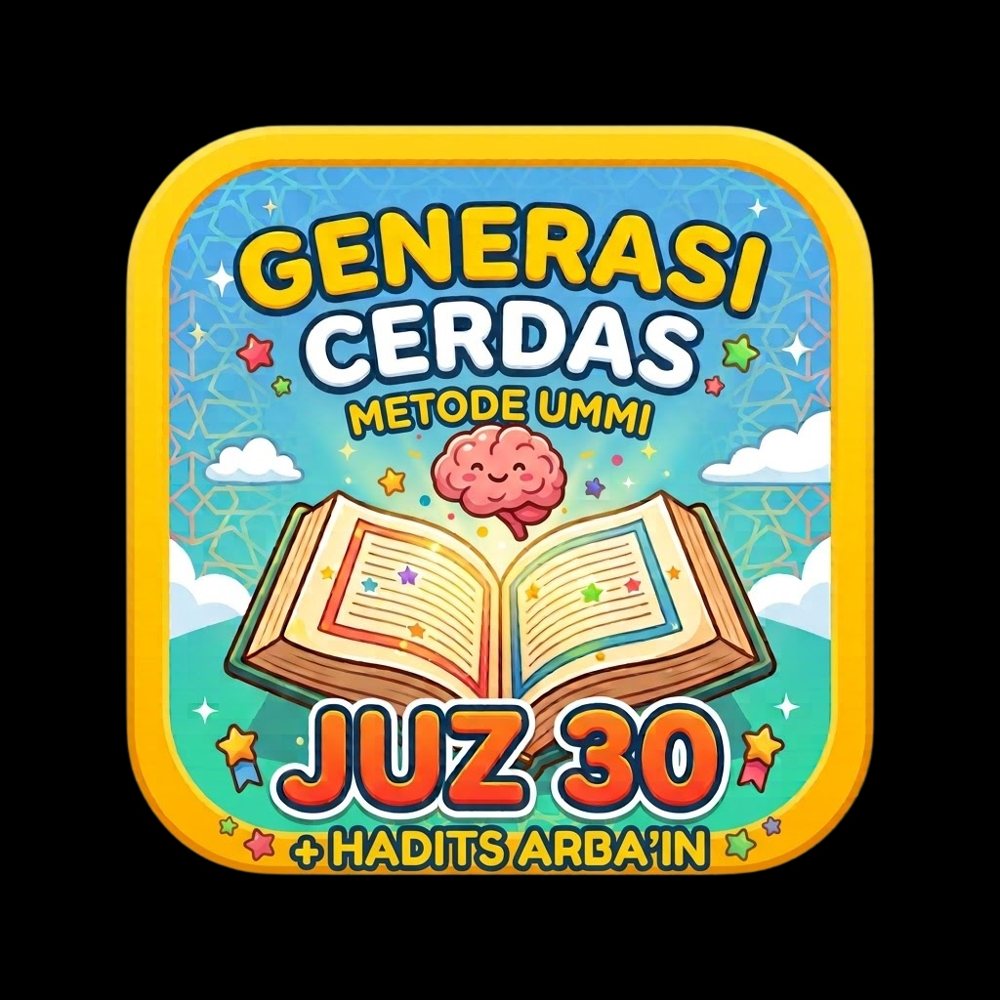

# Generasi Cerdas - Metode Ummi
### Aplikasi Interaktif Hafalan Al-Qur'an Juz 30 & 50 Hadits Arba'in An-Nawawi 🌟

<p align="center">
  
</p>

Aplikasi pembelajaran dan hafalan Al-Qur'an Juz 30 interaktif berbasis **Metode Ummi** dan **50 Hadits Arba'in An-Nawawi** untuk anak ceria, santri cilik, pendidik, dan orang tua. Dilengkapi tampilan modern ceria, audio murottal per ayat, tadabbur makna, evaluasi mingguan, serta sertifikat kelulusan digital.

---

## ✨ Fitur Unggulan

- 📖 **Hafalan Juz 30 Per Ayat & Surah Penuh**
  - Murottal merdu berkualitas tinggi per ayat
  - Tajwid warna dan terjemahan bahasa Indonesia
  - Mode repetisi hafalan (Ulangi Ayat) untuk mempermudah mutqin

- 📜 **50 Hadits Arba'in An-Nawawi**
  - Teks Arab berharakat, transliterasi Latin, dan terjemahan lengkap
  - Penjelasan faedah hadits & pesan moral untuk santri
  - Fitur centang hafalan hadits dan persentase capaian

- ✨ **Kisah & Tadabbur Makna Surah**
  - Kisah asbabun nuzul & hikmah mendalam setiap surat
  - Fitur narasi suara interaktif (Text-to-Speech)
  - Amalan cilik sehari-hari

- 🎓 **Sertifikat Kelulusan Digital (Unduh PDF)**
  - Otomatis mencatat nama santri, jumlah surat Al-Qur'an yang dituntaskan, dan jumlah hadits yang dihafal
  - Desain elegan bernuansa emas dan Islami
  - Siap diunduh dalam format PDF atau dicetak langsung

- 🔐 **Autentikasi & Penyimpanan Multi-Akun**
  - Masuk praktis dengan Google Identity Services (One-Tap / Google Sign-In)
  - Masuk & Daftar via Email dengan verifikasi kata sandi
  - Fitur reset kata sandi (Lupa Password)
  - Riwayat dan progres hafalan terisolasi rapi per akun santri

- 📱 **Desain Responsif & PWA Ready**
  - Tampilan desktop (sidebar navigasi) & mobile (header & bottom bar tetap di layar)
  - Dilengkapi Web App Manifest (`manifest.json`) dan Favicon resmi
  - Thumbnail tautan dinamis (*Open Graph & Twitter Cards*) saat link disebarkan di WhatsApp, Telegram, dll.

---

## 🚀 Cara Menjalankan

Aplikasi ini bersifat standalone web app menggunakan React 18, Babel Standalone, dan Tailwind CSS via CDN.

### Opsi 1: Menjalankan Langsung di Browser
Buka file `index.html` langsung dengan browser modern (Google Chrome, Microsoft Edge, Mozilla Firefox, atau Safari).

### Opsi 2: Menggunakan Local Web Server
```bash
# Menggunakan npx serve
npx serve -l 8080 .

# Atau menggunakan Python 3
python -m http.server 8080
```
Buka browser di alamat `http://localhost:8080/`.

### Opsi 3: Deployment ke Google Apps Script (GAS)
File `Code.js` dan `appsscript.json` telah disediakan jika ingin meng-host aplikasi sebagai Google Web App melalui Google Clasp:
```bash
clasp push
```

---

## 📁 Struktur Direktori

```text
├── index.html          # File utama aplikasi (React UI, state management & mushaf)
├── hadits-data.js      # Database 50 Hadits Arba'in An-Nawawi
├── app-icon.jpg        # Ikon resmi aplikasi (1024x1024)
├── icon.png            # Asset ikon PNG
├── manifest.json       # PWA Manifest untuk pemasangan di Android & iOS
├── qris.jpg            # Gambar QRIS untuk infaq/dukungan pengembangan
├── Code.js             # Skrip Google Apps Script backend bridge
├── appsscript.json     # Konfigurasi manifest Google Apps Script
└── README.md           # Dokumentasi repositori
```

---

## 📄 Lisensi
Hak Cipta © 2026 Generasi Cerdas Metode Ummi. Dibuat untuk kemaslahatan santri dan pejuang penghafal Al-Qur'an.
